# Update Calculator keyboard for greater consistency and extensibility

## Problem Statement
The Calculator keyboard requires some changes to meet the demands of upcoming features, including graphing mode and always-on-top mode. Furthermore, the current standard keyboard could be better at accommodating scaled screen sizes, which improves overall accessibility of the app. There are a number of other problems this spec seeks to address, including reducing confusion over the up arrow used as the shift key and reducing the number of keyboard layout states.

## Evidence or User Insights
The current keyboard is not scalable to support new minimum size requirements for CompactOverlay mode, nor is it extensible to support additional functionality in graphing calculator.

## Proposal
Update they keyboard app-wide for increased consistency and greater extensibility to prepare for upcoming feature improvements.

## Goals and Non-Goals
**Goals**
* No functionality takebacks in existing calculator modes
* Opportunistically add missing functionality across modes
* Increase clarity around shifted operations

**Non-Goals**
* Changes to display option buttons are out of scope (e.g., BYTE/WORD mode in programmer calculator), unless the button is better suited to be included in the keyboard

## Success Criteria
Success here is unblocking future feature development and improving overall accessibility.

## Feature Requirements
| Priority | Requirement |
|:-:|:-|
| P1 | Keyboard in Standard mode is updated to new layout and styling |
| P1 | Keyboard in Scientific mode is updated to new layout and styling |
| P1 | Keyboard in Programmer mode is updated to new layout and styling |
| P1 | Keyboard in Converters are updated to new layout and styling |
| P1 | Create new Operator Overflow Panel and operator groupings |
| P1 | Calculator font updated with new/updated icons to support keyboard changes |
| P2 | Add support for X-Y focus keyboard navigation using arrow keys |
| P2 | Keyboard in Graphing Mode added with new layout and styling |

## Feature Details and High-Fidelity Concept

_**Note:** Strings and icons below are not final._

Standard Mode

### Standard Mode
Standard Calculator functionality which offers basic operations and evaluates commands immediately as they are entered.

||| 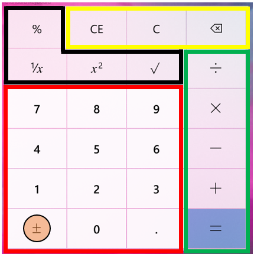|
|:-:|:-:|:-:|
| Before | After | Annotated |

**Red Region - Number Pad**
* Standard number pad across all keyboards
* Button styling extended to sign and decimal buttons

**Green Region - Operator Pad**
* Core arithmetic operators always grouped and ordered the same across all keyboards
* “Submit” button is always bottom-right corner across all keyboards
* “Submit” button has styling applied to draw user attention

**Yellow Region - Backspace/Clear**
* Backspace and clear buttons moved to upper-right corner across all keyboards

**Black Region - Mode-specific**
* Space not used by common keyboard components are reserved for mode-specific buttons
* Like operators are grouped together, when possible

Scientific Mode

### Scientific Mode
Scientific Calculator functionality which offers expanded operations and evaluates commands using order of operations.

||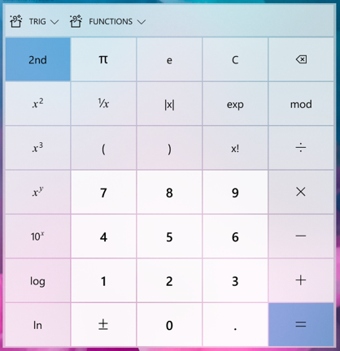|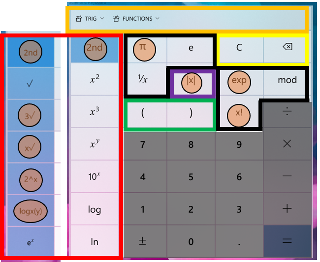|
|:-:|:-:|:-:|
| Before | After | Annotated |

**Red Region - Shifted Operators**
* In supported keyboards, 2nd bar will always appear here in this grouping
* Shifted operations have visual treatment applied
* Shifted operations must either be the inverse operation or a variation of unshifted operator
* Adding cubes and cubic root buttons
* Adding 2x button
* Adding logxy button

**Yellow Region - Backspace/Clear**
* Outside of Standard mode, we combine CE and C buttons into one
* By default, “CE” will appear to allow user to clear everything
* Once there is input, “C” will appear instead to allow user to clear current input

**Green Region - Parenthesis**
* In supported keyboards, parenthesis will always appear here in this grouping

**Orange Region - Operator Groups**
* Modes with rich functionality will utilize a new operator overflow panel for easy access to sets of operators
* Operator groups are consistent between modes
* Scientific has following overflow operator groups
  * Trig (sin, cos, tan, sec, csc, cot, with hyperbolics and inverse variants)
  * Functions (abs, floor, ceil, rand, dms, deg)
* See overflow panel section for more details

**Purple Region - New Operators**
* Add absolute value to scientific calculator

**Black Region - Mode-specific**
* Space not used by common keyboard components are reserved for mode-specific buttons
* Like operators are grouped together, when possible

Programmer Mode

### Programmer Mode
Programmer Calculator functionality which offers common mathematical operations for developers including conversion between common bases.

|||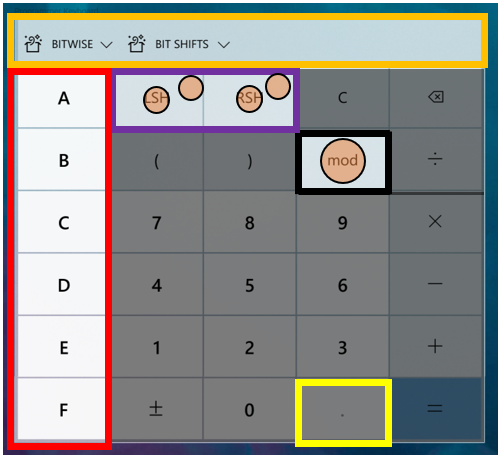|
|:-:|:-:|:-:|
| Before | After | Annotated |

**Red Region - HEX Values**
* A-F buttons available for HEX input along left side
* Use same style as number pad

**Orange Region - Operator Groups**
* Programmer has following overflow operator groups
  * Bitwise Operators 
  * Bit Shifts
* Adding support for NAND, NOR and XNOR bitwise operators
* Adding support for logical left/right and rotate through carry circular left/right bit sifts
* See overflow panel slide for more details

**Yellow Region - Decimal**
* Decimal key disabled in programmer mode (same as today)

**Purple Region - New Shift Behavior**
* Adding Left and Right Shift buttons, since those can be done in rapid succession. Option to change shift mode moved to operator group.
* Indicator will display when non-default shift is active in upper-right corner.

**Black Region - Mode-specific**
* Space not used by common keyboard components are reserved for mode-specific buttons
* Like operators are grouped together, when possible

Converters

### Converters
Conversion between many units of measurement.

|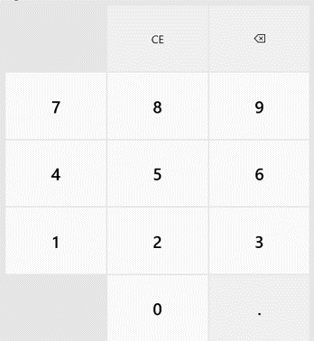||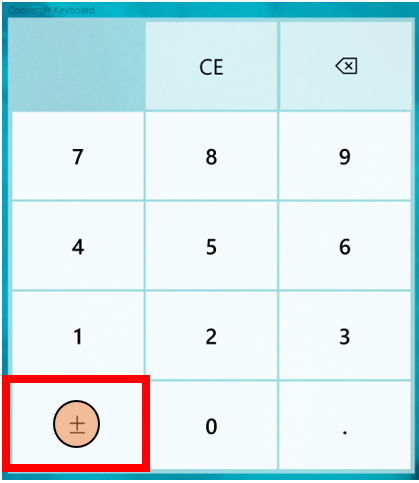|
|:-:|:-:|:-:|
| Before | After | Annotated |

**Red Region - Sign Button**
* Sign button should only appear in supported modes and is enabled for all data types that support negative values:
  * Temperature (sub-zero temperatures; when input is Kelvin, disable sign button)
  * Power (time-rate of energy, which can be negative)
  * Angle (negative angles)
* Decimal Button should be enabled for all conversations (no change)

Graphing Mode

### Graphing Mode (_new_)

||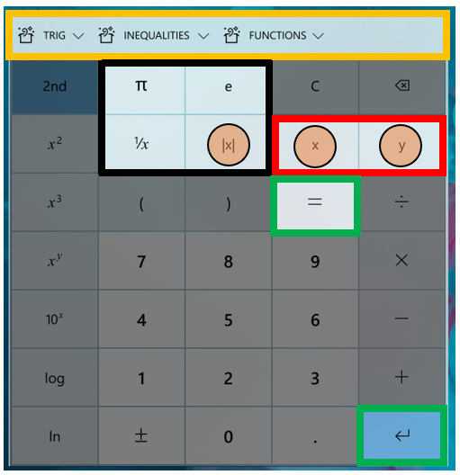|
|:-:|:-:|
| After | Annotated |

**Orange Region - Operator Groups**
* Graphing has following overflow operator groups
  * Trig (same as Scientific)
  * Inequalities (=, <, <=, >, >=)
  * Functions (floor, ceil, and abs)
* See overflow panel slide for more details

**Red Region - Variables**
* X and Y are special variables exposed top-level

**Green Region - Equals and Submit**
* In graphing mode, the equals button means something else, so the “submit” button is replaced with a submit/enter button to plot the equation in bottom-right corner
* The “=“ button is exposed top-level (also included in variables operator overflow group)

**Black Region - Mode-specific**
* Space not used by common keyboard components are reserved for mode-specific buttons
* Like operators are grouped together, when possible

Operator Panels

### Operator Panels
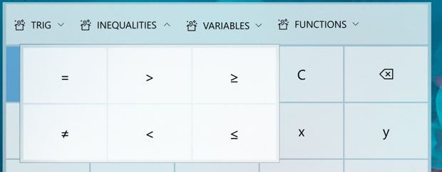
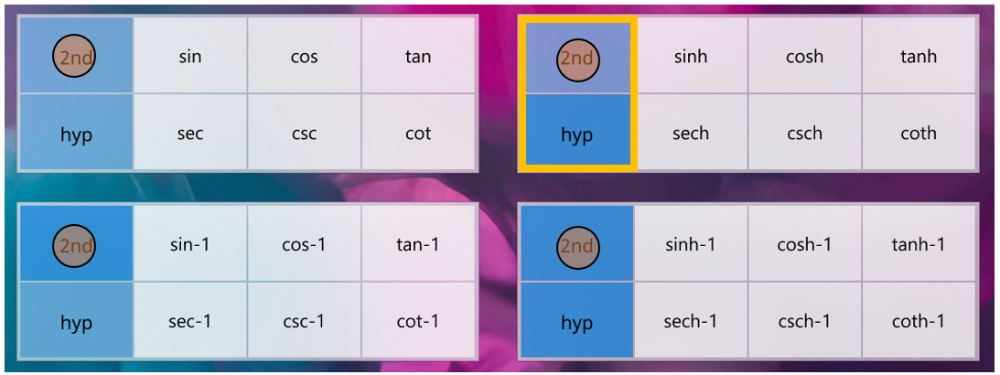
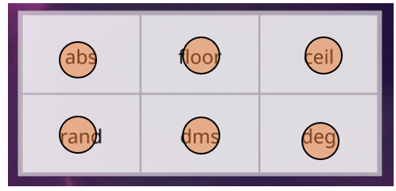
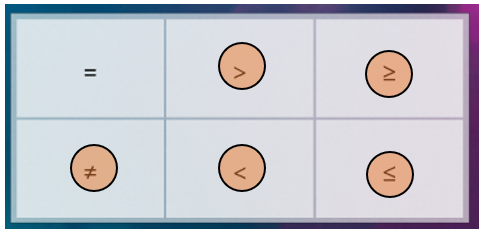
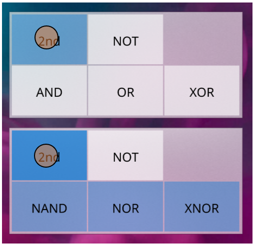
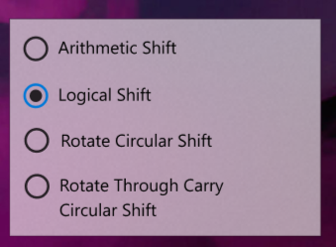

Scaling

### Scaling
We are reducing the number of distinct keyboard layout states to _two_.

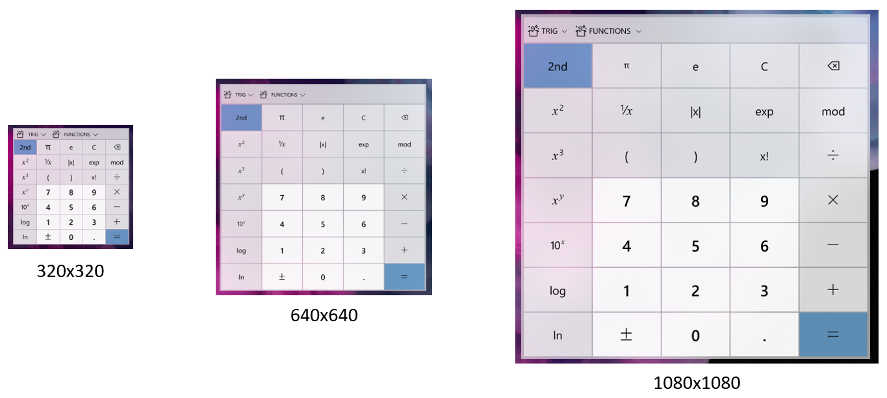

* Subtitle (20)/Title (24) font size for buttons/numpad buttons on small (320x320) and medium (640x640) layouts
* Sub-Header (34)/Header (48) font size for buttons/numpad buttons on large (1080x1080) layouts

Accessibility

### Accessibility
* Add support for X-Y focus navigation when focus is inside of any keyboard area (including overflow panels)
* Addresses feedback from recent Calculator accessibility review as one of the issues preventing us from achieving an “A” rating

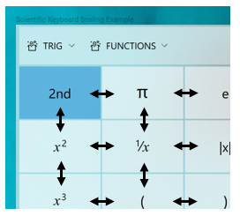

